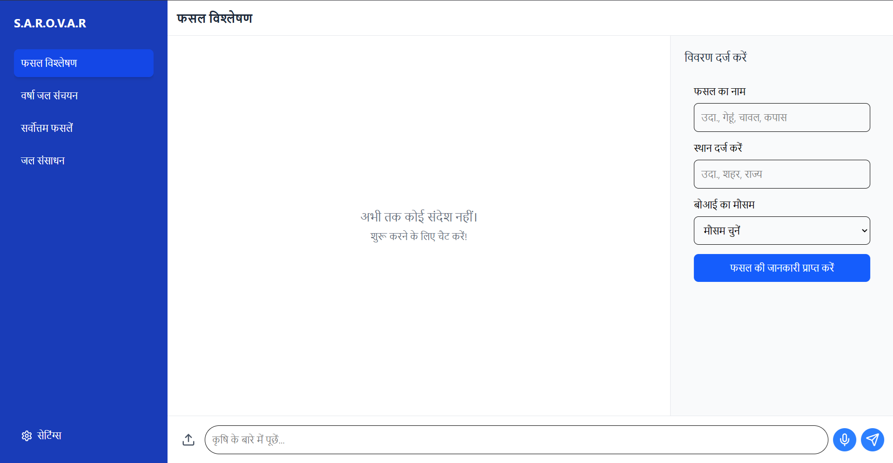

# 🌊 S.A.R.O.V.A.R (Smart AI Resource Optimization for Vital Aquatic Reserves)

*Empowering rural communities with AI-driven water management*

---

## 📌 Overview

SAROVAR is an **AI-powered chatbot platform** designed to help rural communities optimize water usage by analyzing weather patterns, groundwater levels, and crop needs. This project provides real-time insights to farmers and policymakers for sustainable water management.



---

## ✨ Key Features

- **🌦️ AI-Powered Water Forecasts** - Predicts water availability using ML models  
- **🌱 Smart Irrigation Advice** - Personalized crop-water recommendations  
- **🚨 Proactive Alerts** - Early warnings for droughts/water shortages  
- **🗣️ Multilingual Voice Support** - Hindi, Marathi & English voice interface  
- **📊 Data Integration** - Processes satellite, IoT sensor & government water data  

---

## 🛠️ Tech Stack

**Frontend:**  

  
**Backend:**  

  
**AI/ML:**  

  
**Database:**  
  

---

## 🚀 Installation

### Prerequisites
- Node.js v18+
- MongoDB Atlas account
- Google Gemini API key

### Setup Instructions

1. **Clone the repository**
   ```bash
   git clone https://github.com/yourusername/sarovar.git
   cd sarovar
   ```

2. **Install dependencies**
   ```bash
   npm install
   cd client && npm install
   ```

3. **Configure environment variables**  
   Create `.env` file in root:
   ```env
   MONGODB_URI=your_mongodb_connection_string
   GEMINI_API_KEY=your_google_gemini_key
   ```

4. **Run the application**
   ```bash
   npm run dev  # Starts both frontend and backend
   ```

---

## 🖥️ Usage Guide

1. **Access the Chatbot**  
   Open `http://localhost:3000` in your browser

2. **Key Interactions**:
   - 💬 Ask about water availability: *"When will the next rainfall occur?"*
   - 🌾 Get crop advice: *"Best crops for current soil moisture?"*
   - 🚰 Report issues: *"There's a water leak in my village"*

3. **Voice Commands**  
   Click the 🎤 icon and speak in Hindi/Marathi/English

---

## 📂 Project Structure

```
sarovar/
├── client/               # Frontend (React/Vite)
│   ├── public/           # Static assets
│   └── src/              # React components
├── server/               # Backend (Node/Express)
│   ├── models/           # MongoDB schemas
│   └── routes/           # API endpoints
├── ml_models/            # Water prediction models
└── docs/                 # Project documentation
```

---

## 🤝 How to Contribute

1. Fork the repository  
2. Create a new branch (`git checkout -b feature/your-feature`)  
3. Commit changes (`git commit -m 'Add some feature'`)  
4. Push to branch (`git push origin feature/your-feature`)  
5. Open a Pull Request  

---

## 📜 License

This project is licensed under the **MIT License** - see the [LICENSE](./LICENSE) file for details.


---

> "Water is the driving force of all nature." - Leonardo da Vinci  

**Let's build a water-secure future together!** 💧🌍